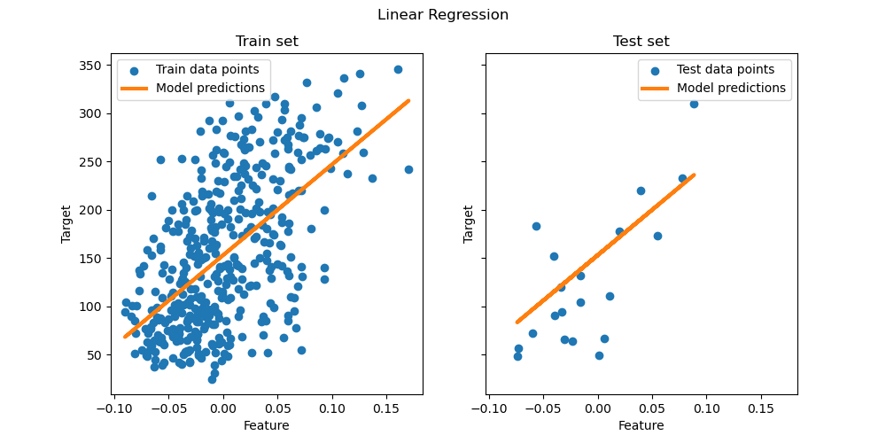

    <h1>Linear Regression</h1>

## What is Linear Regression?
It is an equation used to estimate the value of a variable y based on the value of another variable x. It serves to predict a value that cannot be known directly. It is called 'linear' because it considers a direct relationship between the variables and the parameters provided. To determine the expected value, an equation is used to determine the relationship between both variables.

$$
y_i = \alpha + \beta x_i + \varepsilon_i
$$

**$y_i$**: is the explained (dependent) variable, which represents what the model will try to predict.  
**$\alpha$**: is a constant that represents the intersection of the line with the vertical axis, the angular coefficient in relation to the explained variable.  
**$\beta$**: the **slope (coefficient)** — it indicates how much $y$ changes with a unit change in $x$.  
**$x_i$**: the explained variable or **independent variable (feature)** used to explain or predict $y$.  
**$\varepsilon_i$**: the **error term** — represents everything that affects $y$ but is not captured by $x$.

> **Exemple**  
we want to predict the price of an ice cream based on the temperature of the day (x). The hotter the day, the greater the chance of selling at a higher price. A linear equation could be:
$$
y = 2x + 1
$$
 If the temperature is 30°C, the estimated price of the ice cream would be:
$$
y = 2 \times 30 + 1 = 61
$$

## How is it applied in Artificial Intelligence?

Linear regression is one of the simplest and oldest supervised machine learning algorithms. It teaches a model to predict a numerical value (such as price, temperature, sales, etc.) based on previous data.

It helps to understand fundamental concepts such as:

- Model training  
- Error and parameter tuning  
- Overfitting (when the model learns "too much" and doesn't generalize well)  

Despite its simplicity, linear regression (and its variations like logistic regression) appears in many real-world systems, such as:

- Recommender systems (e.g., predicting the rating a user would give to a movie)  
- Demand forecasting  
- Trend detection in data  

Linear regression concepts are foundational for more advanced models like neural networks.  
For example: a layer in a neural network can be seen as multiple linear equations followed by nonlinear functions.

versao do python usado é 10 pip install scikit-learn